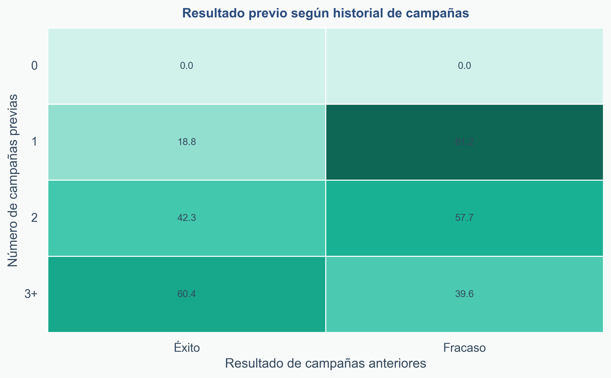
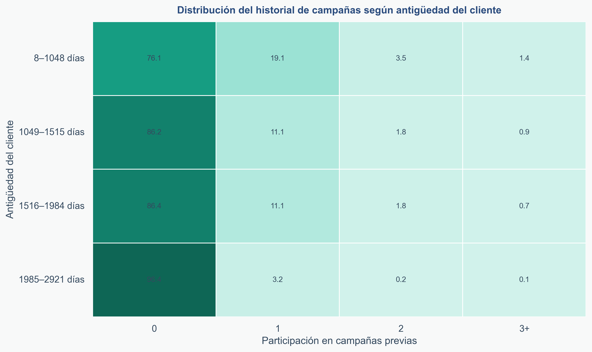
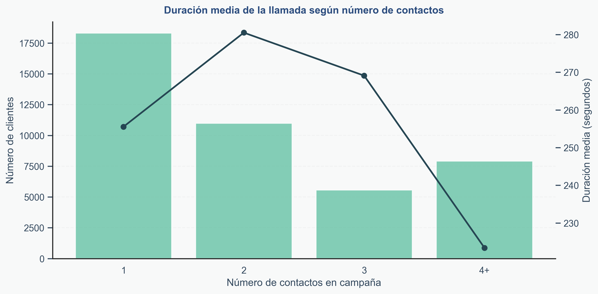
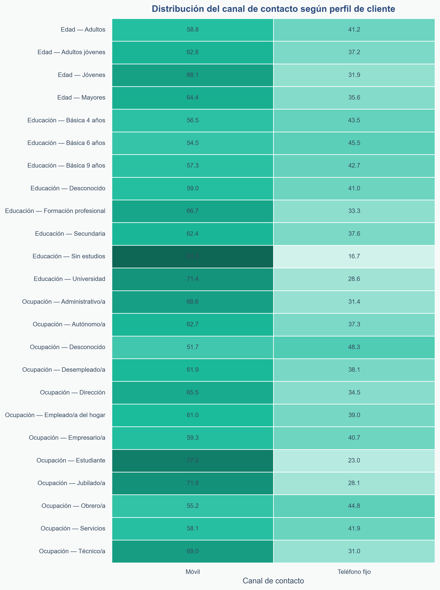
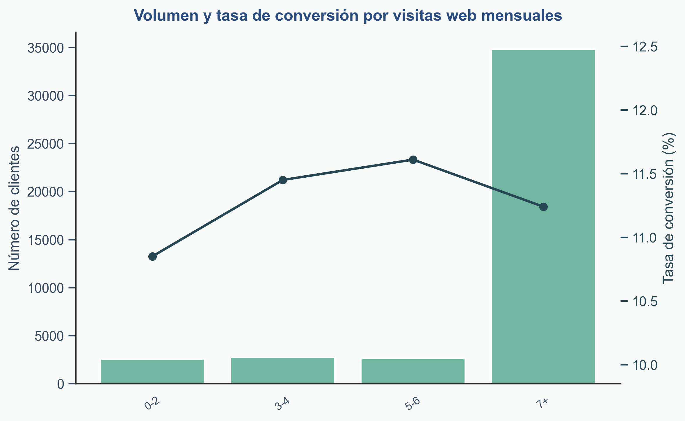

# 📊 Análisis de Campañas de Marketing Bancario

<p align="center">
  
  
  
</p>

---

## 🧠 Objetivo

Este proyecto analiza los factores que influyen en la **conversión de una campaña de telemarketing** en un entorno bancario, con enfoque claramente orientado a negocio.

👉 No solo responde al *qué ocurre*, sino al *por qué ocurre y qué hacer con ello*.

---

## 🎯 Enfoque del análisis

El análisis sigue un enfoque estructurado, recorriendo el proceso completo desde la preparación del dato hasta la obtención de conclusiones de negocio:

- 🧱 Preparación y construcción del dataset  
- 🧹 Limpieza y transformación de los datos  
- 🔍 Exploración preliminar del dataset  
- 👤 Análisis del perfil del cliente y su relación con la entidad  
- 📅 Análisis temporal  
- 📊 Análisis de variables macroeconómicas  
- 🌍 Análisis geográfico  
- 🔗 Análisis de relaciones entre variables  
- 💡 Traducción de los hallazgos en conclusiones y recomendaciones  

---

## 🗂️ Estructura del proyecto

```
├── data/
│ ├── raw/
│ └── processed/
├── figures/
├── notebooks/
│ └── EDA_campaña_banco.ipynb
└── README.md
```

---

# 🔍 Principales insights

---

## 🧩 Síntesis visual del análisis

A continuación se presentan los principales hallazgos del análisis en formato visual, facilitando su interpretación desde una perspectiva de negocio:

<p align="center">
  
</p>

👉 La conversión está fuertemente impulsada por el historial de interacción, destacando especialmente el éxito previo y la recencia del contacto dentro de la campaña.

---

<p align="center">
  
</p>

👉 El perfil del cliente tiene un papel complementario, permitiendo afinar la estrategia pero sin ser el principal driver de conversión.


---

## 📈 El historial comercial es el principal driver

<p align="center">
  
</p>

✔ Los clientes con éxito previo presentan una probabilidad de conversión muy superior  
✔ La activación comercial genera **aprendizaje y afinidad**

---

## 🔁 Activar la cartera genera valor futuro

<p align="center">
  
</p>

✔ La cartera antigua está infra-activada  
✔ Existe una oportunidad clara de generación de valor  

👉 **La conversión se construye, no aparece**

---

## ⚙️ La presión comercial tiene límites

<p align="center">
  
</p>

✔ La conversión se concentra en los primeros intentos  
✔ A partir del tercer contacto → menor interés  

👉 Más llamadas ≠ más ventas

---

## 📱 El canal móvil domina, pero existe una oportunidad real en el canal digital

<p align="center">
  
</p>

<p align="center">
  
</p>

✔ Mejor rendimiento del canal móvil en todos los segmentos  
✔ Palanca estructural, consistente en todos los segmentos 

✔ Alto nivel de interacción digital de los clientes  
✔ Más del 80% visita la web de forma recurrente  

👉 Aunque el canal digital no actúa como driver de conversión actualmente, sí representa una oportunidad clara para la activación de la cartera mediante estrategias de marketing digital.

👉 Integrar ambos canales permite evolucionar hacia modelos de activación más escalables, eficientes y menos intrusivos.

---

# 💡 Insight clave

<p align="center">
<b>“No es quién es el cliente, sino en qué momento está y qué relación previa tiene con la entidad.”</b>
</p>

---

# 🚀 Recomendaciones de negocio

## 🟢 1. Activar la cartera (sembrar)

👉 *Si quieres vender mañana, activa hoy*

- Incrementar activación en clientes sin histórico  
- Generar base de clientes “trabajados”  

---

## 🔵 2. Explotar la cartera activada (recoger)

👉 *Si quieres vender hoy, llama a quien ya está activado*

- Priorizar clientes con historial  
- Foco en clientes con éxito previo  

---

## 🟠 3. Optimizar la presión comercial

- Recomendación de cierre en 1–2 contactos  
- Revisar calidad a partir del tercer intento  

👉 Menos intentos = Menor coste + mejor experiencia cliente  

---

## 🟣 4. Potenciar el canal móvil y evolucionar hacia un modelo omnicanal

- Priorizar el canal móvil frente al teléfono fijo  
- Integrar el canal digital como palanca de activación previa al contacto comercial  

👉 Evolucionar hacia un modelo omnicanal permite mejorar la eficiencia, escalar la activación y reducir la dependencia del contacto telefónico.

---

## 🔴 5. Mejorar la calidad de la interacción

- Formación comercial  
- Argumentarios  
- Gestión de objeciones  

---

# 🛠️ Stack tecnológico

<p align="center">
  
  
  
  
  
</p>

---

# 📌 Conclusión

La conversión depende principalmente de:

- 📊 Historial de interacción  
- ⏱️ Momento del contacto  
- 🧠 Calidad de la conversación  

👉 La segmentación, aunque úitl, no es lo prioritaria.

👉 Es cuestión de **timing, activación y ejecución**

---

## 👩‍💻 Autor

**Sara García Carretero**  

🔗 [LinkedIn](https://www.linkedin.com/in/saragarciac)
