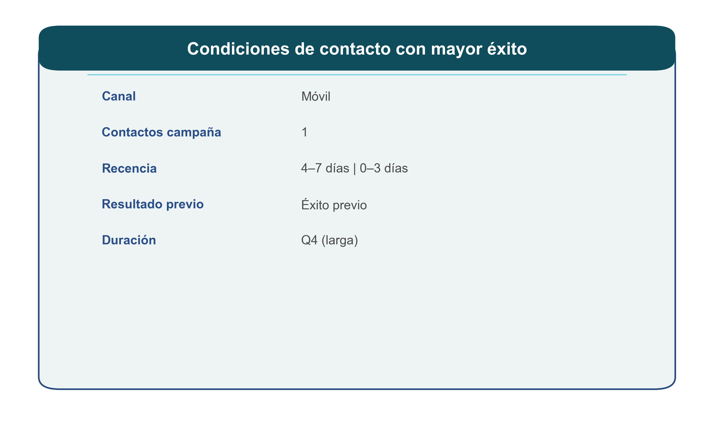
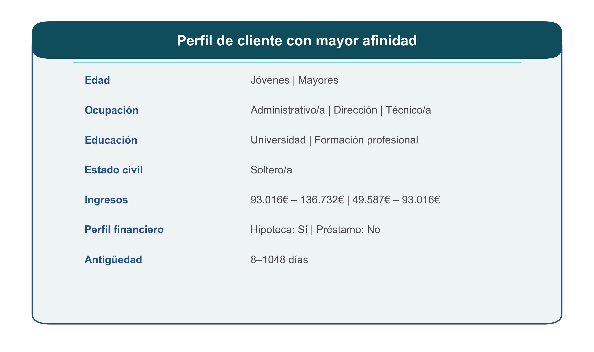

# 📊 Análisis de Campañas de Marketing Bancario

<p align="center">
  
  
  
</p>

---

## 🧠 Objetivo

Este proyecto analiza los factores que influyen en la **conversión de una campaña de telemarketing** en un entorno bancario, con enfoque claramente orientado a negocio.

👉 No solo responde al *qué ocurre*, sino al *por qué ocurre y qué hacer con ello*.

---

## ⚙️ Instalación

Clonar el repositorio e instalar dependencias:

```bash
git clone https://github.com/SaraGarciaC/EDA_con_Python.git
cd EDA_con_Python
pip install -r requirements.txt
```

---

## 🎯 Enfoque del análisis

El análisis sigue un enfoque estructurado, recorriendo el proceso completo desde la preparación del dato hasta la obtención de conclusiones de negocio:

- 🧱 Preparación y construcción del dataset  
- 🧹 Limpieza y transformación de los datos  
- 🔍 Exploración preliminar del dataset  
- 👤 Análisis del perfil del cliente y su relación con la entidad  
- 📅 Análisis temporal  
- 📊 Análisis de variables macroeconómicas  
- 🌍 Análisis geográfico  
- 🔗 Análisis de relaciones entre variables  
- 💡 Traducción de los hallazgos en conclusiones y recomendaciones  

---

## 🗂️ Estructura del proyecto

```
├── data/
│   ├── raw/
│   └── processed/
├── figures/
├── notebooks/
│   └── EDA_campaña_banco.ipynb
├── requirements.txt
└── README.md
```

---

# 🔍 Principales insights

---

## 🧩 Síntesis visual del análisis

<p align="center">
  
</p>

👉 La conversión está fuertemente impulsada por el historial de interacción, destacando especialmente el éxito previo y la recencia del contacto dentro de la campaña.

---

<p align="center">
  
</p>

👉 El perfil del cliente tiene un papel complementario.

---

# 💡 Insight clave

<p align="center">
<b>“No es quién es el cliente, sino en qué momento está y qué relación previa tiene con la entidad.”</b>
</p>

---

## 👩‍💻 Autor

**Sara García Carretero**  
